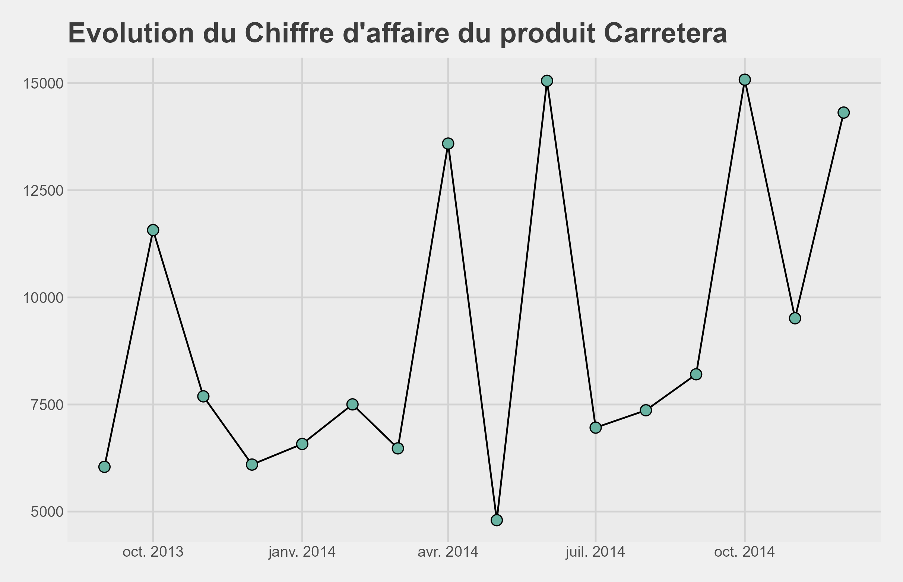

# Company Financials Dataset

Il s'agit d'un jeu de données nécessitant un prétraitement important, offrant des analyses exploratoires (EDA) passionnantes pour une entreprise. Ce dataset comprend des données de ventes et de profits, classées par segment de marché et par pays ou région.

1-Transaction effectuer

2-Quantité de produit

3-Chiffre d'affaire de Paseo

4-Chiffre d'affaire de Carretera

